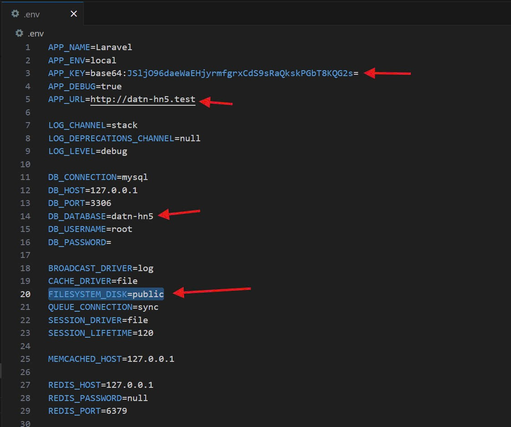
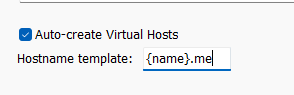
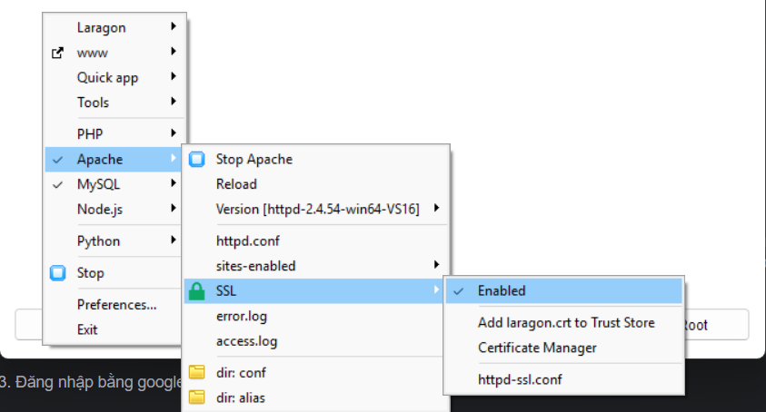

Tài khoản test: 

System Admin:
  - Tk: admin@fpt.edu.vn
  - Mk: admin@fpt.edu.vn
    
Quản lý cơ sở Hà Đông :
  - Tk: quanlycosoHaDong@fpt.edu.vn
  - Mk: quanlycosoHaDong@fpt.edu.vn
    
CÁC CỔNG THANH TOÁN
1. VNPAY
    - Ngân hàng: NCB
    - Số thẻ: 9704198526191432198
    - Tên chủ thẻ: NGUYEN VAN A
    - Ngày phát hành: 07/15
    - Mã OTP: 123456
    
2. MOMO
    - Số thẻ: 9704 0000 0000 0018
    - Tên chủ thẻ: NGUYEN VAN A
    - Ngày phát hành: 03/07
    - Mã OTP: OTP

Các bạn kéo code về thì làm theo các bước sau rồi mới chạy code
- composer update
- tạo file .env, copy toàn bộ nội dung trong file .env.example sang rồi thay giá trị tương ứng vào
- Riêng APP_KEY chạy lệnh: php artisan key:gen
- php artisan migrate
- php artisan storage:link
- Chạy câu lệnh: "composer install" để dùng được gói Laravel UI
- npm run build 
- php artisan queue:work
- php artisan schedule:work (chạy lịch kiểm tra sinh nhật)

1. Cấu hình queue 
- mở file env cấu hình QUEUE_CONNECTION=database
- chạy php artisan queue:table để tạo migrate job_table (cái này tôi chạy rồi anh có trong code rồi anh em không cần phải chạy lại)

2. tại sao phải dùng queue và cách sử dụng
- đối với gửi email thì khá là lâu, nhằm tăng trải nghiệm người dùng thì sẽ dùng queue 
- đối với những tác vụ không ảnh hưởng trực tiếp trên luồng chính và có thể xử lý sau được thì ném hết vào queue ví dụ như gửi mail 
- sử dụng queue thì chỉ cần implements ShouldQueue vào là xong 
- để chạy được queue thì chạy php aritisan queue:work hoặc queue:listen. để ngắt thì Ctrl +C 
- đối với chạy trên hosting thì queue:listen

3. Đăng nhập bằng google 
- Laragon -> setting -> general -> hostname template: {name}.me

Cho ai bị lỗi: 
- php artisan optimize:clear
- xóa cache trên máy (ctrl shìt r)

4. Quét QR 
- vào laragon -> chuột phải -> apache -> ssl -> enabled -> stop laragon -> start lại
- nếu chưa có https: 
+ php artisan optimize:clear
+ tắt trình duyệt / đổi trình duyệt
+ tắt máy bật lại

CÁC CỔNG THANH TOÁN
1. VNPAY
    Ngân hàng: NCB
    Số thẻ: 9704198526191432198
    Tên chủ thẻ: NGUYEN VAN A
    Ngày phát hành: 07/15
    Mã OTP: 123456
    
2. MOMO
    Số thẻ: 9704 0000 0000 0018
    Tên chủ thẻ: NGUYEN VAN A
    Ngày phát hành: 03/07
    Mã OTP: OTP
3. ZALOPAY
    1. Thông tin thẻ Visa, Master, JCB
    Số thẻ:	        4111111111111111
    Tên:	        NGUYEN VAN A
    Ngày hết hạn:	01/25
    Mã CVV:	        123
    2. Danh sách thẻ ATM (test với bank SBI)

    2.1. Thẻ hợp lệ
    STT	Số thẻ	            Tên chủ thẻ	    Ngày phát hành
    1	9704540000000062	NGUYEN VAN A	1018
    2	9704540000000070	NGUYEN VAN A	1018
    3	9704540000000088	NGUYEN VAN A	1018
    4	9704540000000096	NGUYEN VAN A	1018
    5	9704541000000094	NGUYEN VAN A	1018
    6	9704541000000078	NGUYEN VAN A	1018

    2.2. Thẻ bị mất/đánh cắp
    STT	Số thẻ	            Tên chủ thẻ	    Ngày phát hành
    1	9704540000000013	NGUYEN VAN A	1018
    2	9704540000000021	NGUYEN VAN A	1018
    3	9704541000000029	NGUYEN VAN A	1018
    4	9704541000000052	NGUYEN VAN A	1018
    5	9704541000000060	NGUYEN VAN A	1018
    6	9704541000000086	NGUYEN VAN A	1018

    2.3. Thẻ bị timeout
    STT	Số thẻ	            Tên chủ thẻ	    Ngày phát hành
    1	9704540000000039	NGUYEN VAN A	1018
    2	9704541000000037	NGUYEN VAN A	1018
    3	9704540000000054	NGUYEN VAN A	1018

    2.4. Thẻ hết tiền
    STT	Số thẻ	            Tên chủ thẻ	    Ngày phát hành
    1	9704540000000047	NGUYEN VAN A	1018
    2	9704541000000011	NGUYEN VAN A	1018
    3	9704541000000045	NGUYEN VAN A	1018

Cấu hình pusher(lúc nào dùng thì chạy để dùng job: php artisan queue:work )
- PUSHER_APP_ID=1877200
- PUSHER_APP_KEY=1393e8dc64cdba3b56ad
- PUSHER_APP_SECRET=34f630d99b8a7dd390f1
- PUSHER_HOST=
- PUSHER_PORT=443
- PUSHER_SCHEME=https
- PUSHER_APP_CLUSTER=ap1
